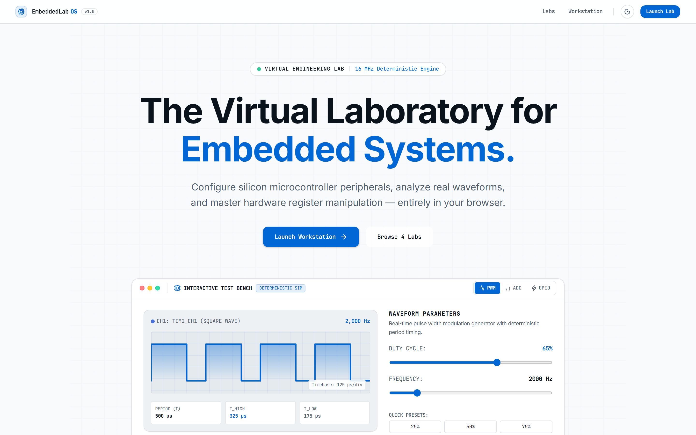
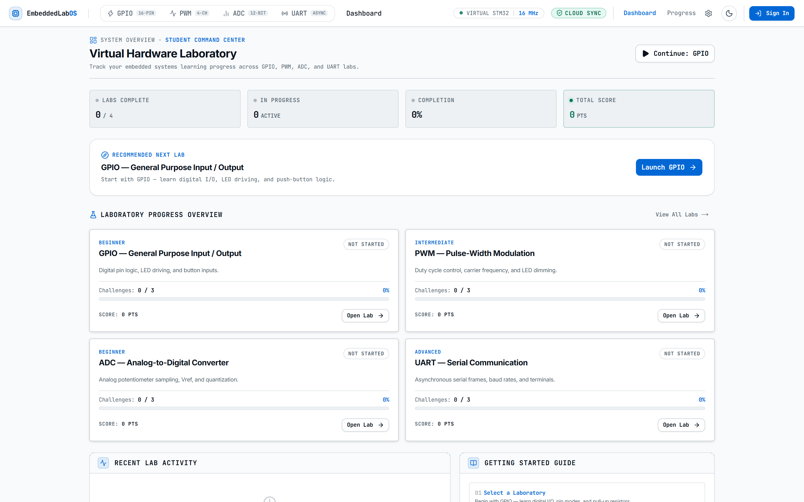
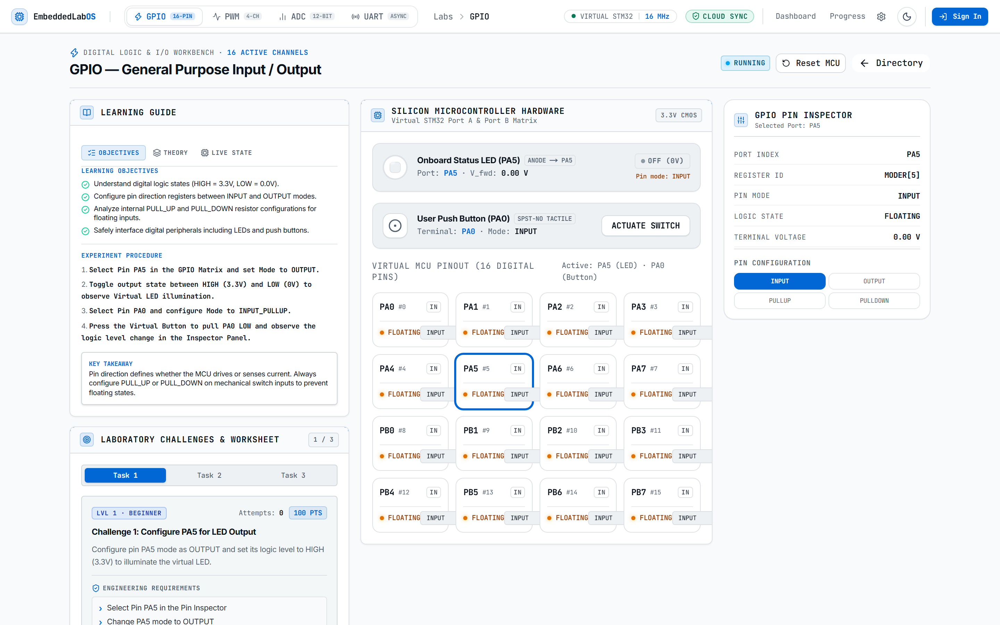
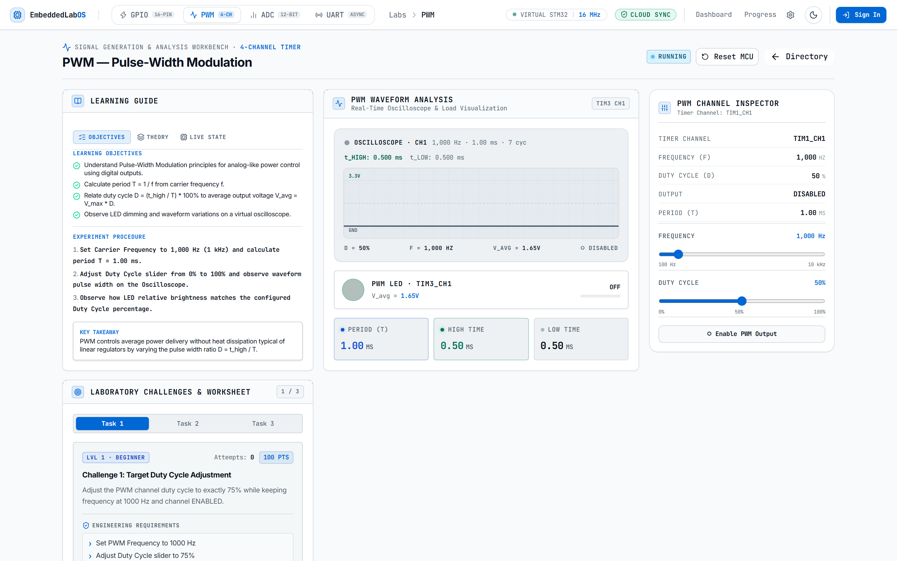
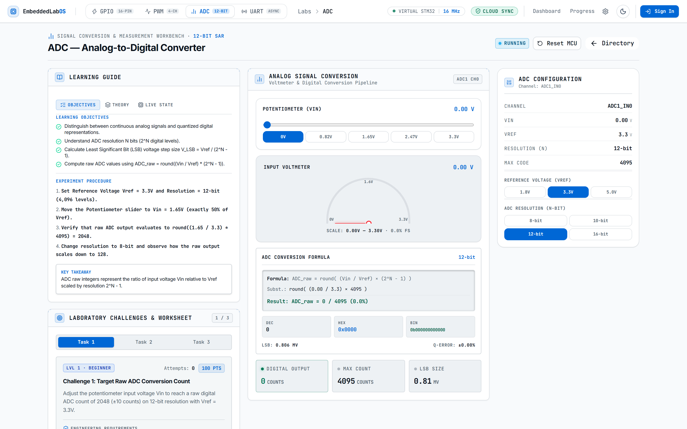
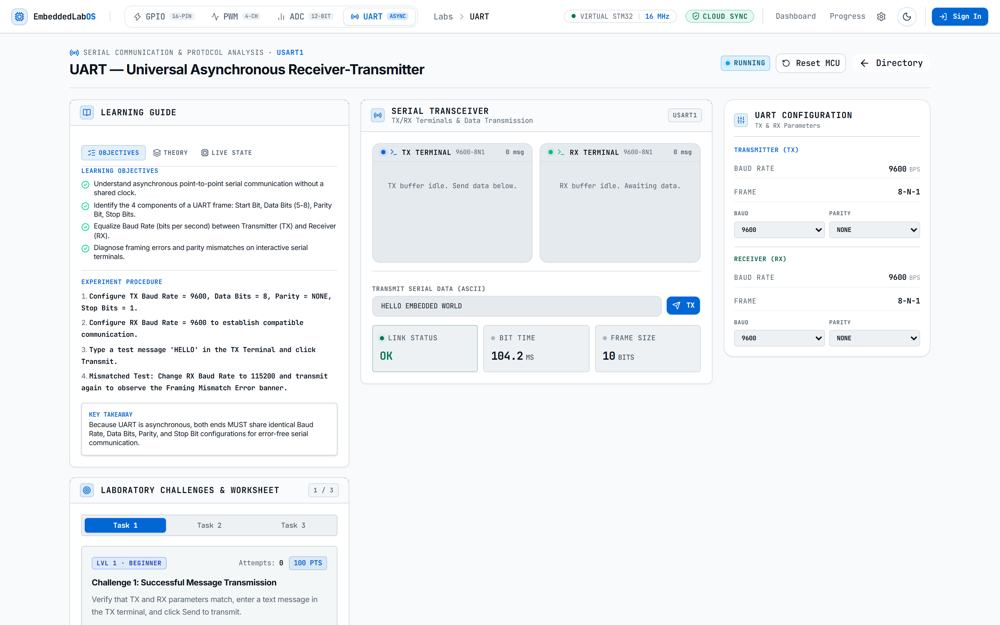
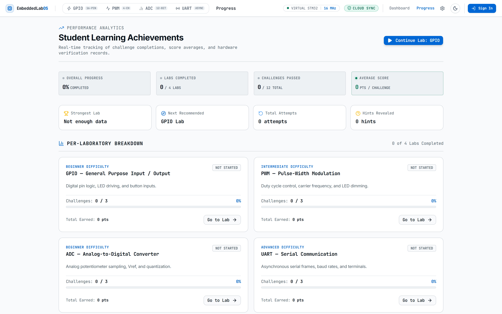

# EmbeddedLab OS

> **A browser-based virtual embedded-systems laboratory designed to help students learn and experiment with fundamental embedded concepts without physical hardware.**

---

## 📖 Overview

**EmbeddedLab OS** is an interactive, browser-based virtual educational laboratory platform designed for undergraduate electrical engineering, computer science, and embedded systems students. It provides a deterministic software simulation of fundamental microcontroller peripherals (**GPIO**, **PWM**, **ADC**, and **UART**) without physical hardware dependencies.

> ℹ️ **Educational Virtual Simulation**: EmbeddedLab OS models microcontroller peripheral behavior, register logic, and timing equations for pedagogical concept mastery. It is an educational virtual simulation and is explicitly **not** a full MCU CPU core emulation, **not** an electrical transistor-level SPICE simulation, and **not** intended for real hardware validation or production hardware verification.

---

## 🎯 Problem Statement

Undergraduate embedded systems coursework often faces critical logistical and pedagogical friction:
- **Hardware Access Constraints**: Physical microcontrollers, oscilloscopes, multimeters, and function generators are expensive and limited in supply for remote or large-capacity classes.
- **Trial-and-Error Bottlenecks**: Wiring mistakes, burnt components, and fragile driver installations create frustrating setup overhead for beginners.
- **Abstract Logic Visualization**: Microcontroller register states and serial protocol waveforms remain invisible without high-end lab instrumentation.

---

## 💡 The Solution

**EmbeddedLab OS** addresses these challenges through:
1. **Interactive Peripheral Simulations**: Real-time virtual instruments modeling register behaviors and peripheral hardware controls.
2. **Guided Laboratories**: Structured undergraduate-level ECE learning objectives, mathematical derivations, and experiment procedures.
3. **Challenge-Based Learning**: Automated verification of microcontroller snapshots (`MicrocontrollerState`) with progressive hints and scoring.
4. **Progress Tracking**: Real-time student performance analytics across all laboratories and challenges.
5. **Contextual AI Assistance**: Scoped AI guidance (`Explain Concept`, `Progressive Hint`, `Debug Hardware State`) powered by Google Gemini 2.5 Flash with offline fallback support.

---

## 🔬 Core MVP Laboratories

EmbeddedLab OS features four foundational peripheral laboratories:

### 1. General Purpose Input / Output (GPIO) Lab
- **Digital Logic States**: `HIGH` ($3.3\text{ V}$), `LOW` ($0.0\text{ V}$), and `FLOATING`.
- **Direction Registers**: `INPUT`, `OUTPUT`, and internal $\sim 40\text{ k}\Omega$ pull resistors (`INPUT_PULLUP`, `INPUT_PULLDOWN`).
- **Interactive Visualizers**: 16-pin MCU matrix (`PA0`..`PB7`), virtual LED illumination, and pushbutton switch stimulus.
- **Challenges**:
  - *Basic LED Output*: Drive pin `PA5` HIGH to illuminate the virtual LED.
  - *Pull-Up Switch Reading*: Configure `PA0` as `INPUT_PULLUP` and read button state transitions.
  - *GPIO Misconfiguration Diagnosis*: Identify and repair an erroneously configured pin mode.

### 2. Pulse-Width Modulation (PWM) Lab
- **Timing Relationships**: Period ($T = 1/f$), active pulse duration ($t_{\text{high}} = T \times D$), and average output voltage ($V_{\text{avg}} = V_{\text{max}} \times D$).
- **Carrier Frequency**: Adjustable from $100\text{ Hz}$ to $10,000\text{ Hz}$ with duty cycles from $0\%$ to $100\%$.
- **Interactive Visualizers**: Dynamic SVG oscilloscope square-wave visualizer with frequency-scaled cycle density and virtual LED dimmer.
- **Challenges**:
  - *Configure Carrier Frequency*: Set $f = 1,000\text{ Hz}$ ($T = 1.00\text{ ms}$) at $75\%$ duty cycle.
  - *Period Matching*: Derive exact carrier frequency for a target $2.00\text{ ms}$ period ($500\text{ Hz}$).
  - *PWM Channel Reconfiguration*: Diagnose and enable a misconfigured PWM timer channel.

### 3. Analog-to-Digital Converter (ADC) Lab
- **Quantization Formula**: $\text{ADC}_{\text{raw}} = \text{round}\left(\frac{\min(V_{\text{in}}, V_{\text{ref}})}{V_{\text{ref}}} \times (2^N - 1)\right)$.
- **Resolution & Scaling**: Selectable $8$, $10$, $12$, and $16\text{-bit}$ resolution levels with reference voltages ($1.8\text{V}$, $3.3\text{V}$, $5.0\text{V}$).
- **Interactive Visualizers**: Rotational analog voltmeter gauge dial, virtual potentiometer slider, and live LSB resolution readout.
- **Challenges**:
  - *Target Raw ADC Count*: Adjust $V_{\text{in}}$ to produce mid-scale reading ($2048 \pm 10\text{ counts}$) under $12\text{-bit}$ mode.
  - *Precision Voltage Alignment*: Set potentiometer to exact target voltage thresholds ($2.50\text{ V} \pm 0.05\text{ V}$).
  - *Vref Misconfiguration Diagnosis*: Identify and fix reference saturation issues.

### 4. Universal Asynchronous Receiver-Transmitter (UART) Lab
- **Asynchronous Protocol**: Independent TX/RX baud rate matching ($300 \dots 115,200\text{ bps}$), data bits ($5\text{--}8$), parity (`NONE`, `EVEN`, `ODD`), and stop bits ($1\text{--}2$).
- **Interactive Visualizers**: Dual serial terminals (TX / RX), framing error diagnostic banner, and bit timing inspectors.
- **Challenges**:
  - *Basic Message Transmission*: Transmit a test string over matching TX/RX parameters.
  - *Target Baud Rate Setup*: Configure terminals to 115,200 baud 8-E-1.
  - *Baud Rate Mismatch Resolution*: Troubleshoot and resolve framing error conditions.

---

## 🤖 Contextual AI Learning Assistance

EmbeddedLab OS incorporates a scoped, privacy-sanitized AI assistant powered by **Google Gemini 2.5 Flash**:

- **Explain Concept**: Contextual breakdown of active peripheral engineering theory.
- **Progressive Hint**: Step-by-step guidance without disclosing exact answers.
- **Debug Hardware State**: Analyzes live microcontroller register snapshots for timing or configuration errors.

> ⚠️ **Educational Advisory**: AI assistance is provided as a learning aid and does not replace formal engineering verification or mathematical derivations. If `GEMINI_API_KEY` is omitted, the application automatically uses deterministic offline fallback generators without disruption.

---

## 🏗️ System Architecture

*For detailed architectural specifications, state machine definitions, and simulation boundaries, refer to [`ARCHITECTURE.md`](./ARCHITECTURE.md).*


```text
┌────────────────────────────────────────────────────────┐
│               User Interface (App Router)              │
│       Dashboard  •  Labs  •  Progress  •  Auth         │
└───────────────────────────┬────────────────────────────┘
                            │
┌───────────────────────────▼────────────────────────────┐
│                    Custom Hooks Layer                  │
│   useGPIOState  •  usePWMState  •  useADCState  • etc. │
└───────────────────────────┬────────────────────────────┘
                            │
┌───────────────────────────▼────────────────────────────┐
│               Zustand Global State Stores              │
│         simulator-store.ts  •  challenge-store.ts      │
└─────────────┬────────────────────────────┬─────────────┘
              │                            │
┌─────────────▼──────────────┐ ┌───────────▼─────────────┐
│    Deterministic Engine    │ │  Pure State Validators  │
│  GPIO • PWM • ADC • UART   │ │ 12 Peripheral Challenges│
└─────────────┬──────────────┘ └───────────┬─────────────┘
              │                            │
┌─────────────▼────────────────────────────▼─────────────┐
│               Persistence & External APIs              │
│     Supabase (@supabase/ssr)  •  Gemini 2.5 Flash      │
└────────────────────────────────────────────────────────┘
```

---

## 💻 Technology Stack

- **Framework**: [Next.js 16](https://nextjs.org/) (App Router, Turbopack)
- **Frontend Core**: [React 19](https://react.dev/) & [TypeScript 5](https://www.typescriptlang.org/) (Strict Mode)
- **Styling**: [Tailwind CSS v4](https://tailwindcss.com/) & OKLCH Dark Engineering Theme
- **State Management**: [Zustand 5](https://github.com/pmndrs/zustand)
- **Charts & Visualization**: [Recharts](https://recharts.org/)
- **Backend & Auth**: [Supabase `@supabase/ssr`](https://supabase.com/) (PostgreSQL with RLS)
- **AI Integration**: [Google Gen AI SDK `@google/genai`](https://www.npmjs.com/package/@google/genai)
- **Testing**: [Vitest 4](https://vitest.dev/)

---

## 📁 Project Structure

```text
EmbeddedLab OS/
├── embeddedlab-os/
│   ├── __tests__/                  # Unit & integration test suites
│   │   ├── ai/                     # AI route security & service tests
│   │   ├── challenges/             # Challenge validation test suites
│   │   ├── education/              # Educational content schema tests
│   │   ├── legal/                  # Privacy & transparency test suite
│   │   ├── simulator/              # GPIO, PWM, ADC, UART engine tests
│   │   ├── stores/                 # Zustand store tests
│   │   └── supabase/               # Auth & persistence tests
│   ├── app/                        # Next.js App Router routes
│   │   ├── (app)/                  # Authenticated application shell
│   │   │   ├── dashboard/          # Student dashboard
│   │   │   ├── labs/               # Lab directory & workspace pages
│   │   │   ├── progress/           # Student progress analytics
│   │   │   └── settings/           # User & storage configuration
│   │   ├── (auth)/                 # Login & Signup routes
│   │   ├── (marketing)/            # Landing page, privacy, terms, cookies
│   │   └── api/ai/                 # Gemini AI server route handler with security boundary
│   ├── components/                 # React UI components
│   │   ├── lab/                    # Lab-specific visualizers (oscilloscope, gauge, etc.)
│   │   ├── layout/                 # Navigation bars, sidebars, headers
│   │   ├── shared/                 # Challenge panel, education card, event logs
│   │   └── ui/                     # Base design system primitives
│   ├── hooks/                      # Custom React state hooks
│   ├── lib/                        # Core application logic
│   │   ├── ai/                     # Sanitizer & offline fallback generators
│   │   ├── challenges/             # Challenge definitions & pure validators
│   │   ├── education/              # ECE curriculum & theory registry
│   │   ├── simulator/              # Deterministic simulation controllers
│   │   └── supabase/               # Client, server, and db persistence helpers
│   ├── store/                      # Zustand state store instances
│   ├── types/                      # TypeScript interface declarations
│   ├── utils/                      # Supabase SSR server & middleware helpers
│   ├── proxy.ts                    # Next.js 16 session refresh proxy
│   └── package.json                # Project dependencies & scripts
├── public/screenshots/             # Production application screenshots
├── .env.example                    # Environment variable template
└── README.md                       # Project documentation
```

---

## 🚀 Getting Started

### Prerequisites
- **Node.js**: `v20.0.0` or higher
- **npm**: `v10.0.0` or higher

### Installation

1. **Clone the repository**:
   ```bash
   git clone https://github.com/RONALD-REX-7/EmbeddedLab-OS.git
   cd EmbeddedLab-OS/embeddedlab-os
   ```

2. **Install dependencies**:
   ```bash
   npm install
   ```

3. **Configure Environment Variables**:
   Copy `.env.example` to create your local `.env.local` configuration:
   ```bash
   cp .env.example .env.local
   ```
   *(Optional: Edit `.env.local` to supply your Supabase and Gemini credentials, or leave empty to run in Local Demo Mode).*

4. **Start the development server**:
   ```bash
   npm run dev
   ```
   Open [http://localhost:3000](http://localhost:3000) in your web browser.

---

## 🔐 Environment Variables

EmbeddedLab OS strictly separates client-safe public variables from server-only secrets. A template is provided in `.env.example`.

| Variable | Scope | Purpose | Local Dev | Production |
| :--- | :---: | :--- | :---: | :---: |
| `NEXT_PUBLIC_SUPABASE_URL` | **Public (Client-Safe)** | Supabase project endpoint for authentication and progress synchronization | Optional *(Enables Local Demo Mode)* | Required for Cloud Auth |
| `NEXT_PUBLIC_SUPABASE_PUBLISHABLE_KEY` | **Public (Client-Safe)** | Supabase public client API key (anon) | Optional | Required for Cloud Auth |
| `NEXT_PUBLIC_SUPABASE_ANON_KEY` | **Public (Client-Safe)** | Legacy alias fallback for Supabase client key | Optional | Optional |
| `GEMINI_API_KEY` | **Secret (Server-Only)** | Google Gemini API key for server-side AI tutoring (`/api/ai`). **Never expose with `NEXT_PUBLIC_` prefix.** | Optional *(Defaults to Offline Generator)* | Recommended |

> 🔒 **Security Notice**: Never prefix server secrets with `NEXT_PUBLIC_`. The application server route (`app/api/ai/route.ts`) validates, bounds, and sanitizes all client prompts before querying Google Gemini, ensuring that API keys and student identifiers are never exposed to the client or external services.

---

## 🧪 Testing

EmbeddedLab OS includes unit and integration tests across peripheral math, state mutations, challenge validators, educational content, and authentication fallbacks:

```bash
# Run unit & integration test suites
npm run test

# Run TypeScript type validation
npm run type-check

# Run ESLint validation
npm run lint

# Run production build compilation
npm run build
```

### Test Suite Summary
```text
Test Files  17 passed (17)
     Tests  169 passed (169)
```

---

## 🌐 Deployment (Vercel)

To deploy EmbeddedLab OS to [Vercel](https://vercel.com/):

1. Push your repository to GitHub.
2. Import the repository into the Vercel Dashboard.
3. If deploying from the root workspace, set the **Root Directory** to `embeddedlab-os`.
4. Configure your production environment variables (`NEXT_PUBLIC_SUPABASE_URL`, `NEXT_PUBLIC_SUPABASE_PUBLISHABLE_KEY`, `GEMINI_API_KEY`) in the Vercel project settings.
5. Click **Deploy**. Vercel will execute `npm run build` and provision edge CDN assets.

---

## ⚠️ Known Limitations & Scope Boundaries

- **Educational Virtual Simulation**: EmbeddedLab OS models peripheral behavior, register logic, and timing equations for educational concept mastery. It is explicitly **not** a full MCU CPU core emulation, **not** an electrical or SPICE circuit simulation, and is not designed for real hardware validation or production hardware verification.
- **Physical Hardware Interface**: The application runs entirely within modern web browsers and does not interface with physical silicon microcontrollers, JTAG/SWD debuggers, or USB programmer hardware.
- **Probabilistic AI Guidance**: AI tutoring suggestions (`Explain Concept`, `Progressive Hint`, `Debug Hardware State`) are generative educational aids and should always be verified against standard engineering formulas and microcontroller reference manuals.
- **Microcontroller Scope**: Currently models standard STM32-style peripheral architectures across 4 foundational domains (GPIO, PWM, ADC, UART). Additional protocols (I²C, SPI, CAN) and hardware interrupt vector controllers (EXTI/NVIC) are planned on the roadmap.

---

## 🗺️ Future Roadmap

- [ ] **I²C & SPI Protocol Laboratories**: Synchronous serial communication, master/slave addressing, and clock polarity/phase (CPOL/CPHA) configurations.
- [ ] **Hardware Interrupts (EXTI)**: Edge-triggered interrupt simulation and ISR callback handling.
- [ ] **Monaco C Code Editor**: Embedded C peripheral initialization code editor with syntax linting.
- [ ] **Instructor Dashboard**: Class-wide challenge metrics and progress inspection for educators.

---

## 📸 Screenshots

The following screenshots are captured directly from the live production deployment at [https://embeddedlab-os.vercel.app/](https://embeddedlab-os.vercel.app/):

### 1. Platform Landing Page
*Interactive laboratory launchpad and curriculum overview.*


### 2. Student Workstation Dashboard
*Active laboratory workspaces, recent achievements, and quick navigation.*


### 3. General Purpose Input / Output (GPIO) Lab
*16-pin MCU matrix (`PA0`..`PB7`), push-button stimulus, and virtual LED logic indicators.*


### 4. Pulse-Width Modulation (PWM) Lab
*Adjustable frequency carrier (100 Hz – 10 kHz), duty cycle modulation, and live SVG oscilloscope waveform visualizer.*


### 5. Analog-to-Digital Converter (ADC) Lab
*Quantization calculations, multi-resolution selection (8/10/12/16-bit), potentiometer voltage divider, and analog voltmeter dial.*


### 6. Universal Asynchronous Receiver-Transmitter (UART) Lab
*Asynchronous dual-terminal transceiver, baud rate negotiation (300 to 115,200 bps), parity checks, and framing error diagnostics.*


### 7. Student Learning Achievements & Analytics
*Challenge verification milestones, score distribution, and learning progress tracking.*


---

## 📄 License

Licensed under the Apache License, Version 2.0 (the "License"); you may not use this file except in compliance with the License.
See the [`LICENSE`](./LICENSE) file for the full license text.

---

## 👨‍💻 Author & Developer

**Ronald Rex**  
- **GitHub**: [@RONALD-REX-7](https://github.com/RONALD-REX-7)  
- **Inquiries & Security**: Please report issues via GitHub Issues or private security advisories.
- **Repository**: [https://github.com/RONALD-REX-7/EmbeddedLab-OS](https://github.com/RONALD-REX-7/EmbeddedLab-OS)
