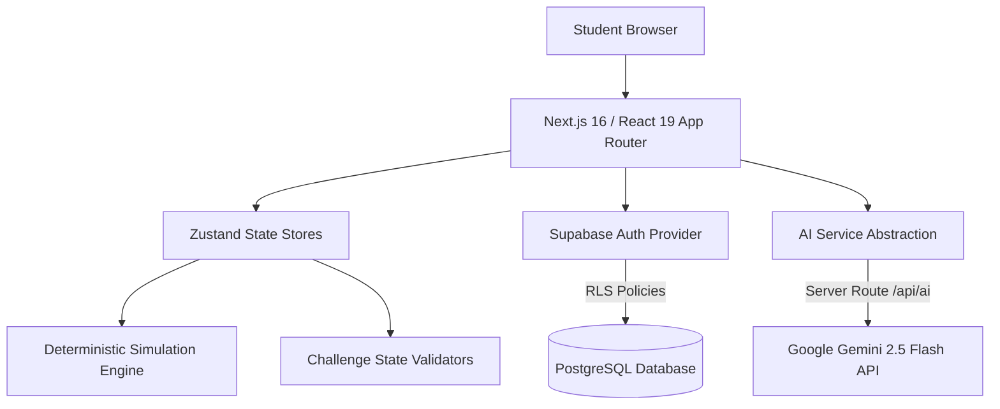

# EmbeddedLab OS — Virtual Embedded Systems Laboratory

**EmbeddedLab OS** is an interactive, browser-based virtual embedded systems laboratory designed for undergraduate electrical engineering, computer science, and embedded systems students. It provides a deterministic software simulation of fundamental microcontroller peripherals (**GPIO**, **PWM**, **ADC**, **UART**) without physical hardware dependencies.

---

## 🎯 Problem Statement

Traditional embedded systems education faces several physical and logistical bottlenecks:
- **Hardware Access Constraints**: Physical microcontrollers, oscilloscopes, function generators, and multimeters are expensive and limited in availability for remote or large-capacity classes.
- **Trial-and-Error Friction**: Wiring mistakes, fried components, and fragile driver installations create frustrating setup overhead for beginners.
- **Abstract Logic Visualization**: Microcontroller register states and serial protocol waveforms remain invisible without high-end lab instrumentation.

---

## 💡 The Solution

**EmbeddedLab OS** bridges the gap between theoretical hardware concepts and practical application by providing:
1. **Zero-Setup Virtual Laboratory**: Run fully interactive peripheral experiments directly inside modern web browsers.
2. **Deterministic Educational Simulation Engine**: Model register state transitions, timing equations, and quantization formulas deterministically.
3. **Automated State Inspection & Challenge System**: Validate student configurations against live microcontroller snapshots (`MicrocontrollerState`) with progressive hints and scoring.
4. **Contextual AI Assistance**: Scoped AI guidance (`Explain Concept`, `Progressive Hint`, `Debug State`) using Google Gemini 2.5 Flash without generic chatbot distractions.

> ⚠️ **Educational Simulation Disclaimer**: EmbeddedLab OS is a **deterministic educational simulation engine**, not a full clock-accurate microcontroller emulator (such as QEMU or Wokwi). It accurately models peripheral behavior, register configurations, and mathematical formulas for educational clarity without low-level transistor timing emulation.

---

## 🔬 Core Laboratories

EmbeddedLab OS features four fundamental embedded peripheral laboratories:

### 1. General Purpose Input / Output (GPIO) Lab
- **Concepts**: Digital logic states (HIGH = 3.3V, LOW = 0.0V), direction registers (`INPUT`, `OUTPUT`), internal ~40kΩ `PULL_UP` and `PULL_DOWN` resistors.
- **Visualizers**: 32-pin matrix with interactive register controls, virtual LED illumination, and pushbutton switch toggles.
- **Challenges**:
  - *Basic LED Output*: Drive PA5 HIGH to illuminate the virtual LED.
  - *Pull-Up Switch Reading*: Configure PA0 as `INPUT_PULLUP` and read button presses.
  - *Blinker System*: Create active output toggling.

### 2. Pulse-Width Modulation (PWM) Lab
- **Concepts**: Duty cycle ($D = t_{\text{high}}/T \times 100\%$), carrier frequency ($f = 100\text{ Hz} \dots 10,000\text{ Hz}$), period ($T = 1/f$), and effective average output voltage ($V_{\text{avg}} = V_{\text{max}} \times D$).
- **Visualizers**: Dynamic SVG oscilloscope square wave visualizer scaling cycle density with frequency, paired with a virtual LED dimmer.
- **Challenges**:
  - *Configure Carrier Frequency*: Set $f = 1,000\text{ Hz}$ ($T = 1.00\text{ ms}$).
  - *Dimming Control*: Match duty cycle to target $V_{\text{avg}}$.
  - *Precision Frequency Calibration*: Derive exact period timings.

### 3. Analog-to-Digital Converter (ADC) Lab
- **Concepts**: Continuous analog signals vs discrete digital quantization, reference voltage ($V_{\text{ref}}$), resolution levels ($N = 8, 10, 12, 16\text{ bits}$), and Least Significant Bit (LSB) step size ($V_{\text{LSB}} = V_{\text{ref}} / (2^N - 1)$).
- **Formula**: $\text{ADC}_{\text{raw}} = \text{round}\left(\frac{\min(V_{\text{in}}, V_{\text{ref}})}{V_{\text{ref}}} \times (2^N - 1)\right)$.
- **Visualizers**: Analog voltmeter gauge dial, potentiometer slider ($0V \to V_{\text{ref}}$), and real-time quantization conversion formula readout.
- **Challenges**:
  - *Target Raw ADC Value*: Reach exact $\text{ADC}_{\text{raw}}$ target under 12-bit resolution.
  - *Precision Voltage Alignment*: Sweep $V_{\text{in}}$ to target voltage thresholds.
  - *Vref Misconfiguration Diagnosis*: Identify and fix full-scale saturation issues.

### 4. Universal Asynchronous Receiver-Transmitter (UART) Lab
- **Concepts**: Asynchronous serial communication without shared clocks, baud rate matching, frame structure (Start bit, 5–8 Data bits, Parity, 1–2 Stop bits), and TX/RX serial buffer operations.
- **Visualizers**: Configuration inspector, interactive TX terminal, RX terminal, and framing mismatch error diagnostic banner.
- **Challenges**:
  - *Basic Message Transmission*: Match TX/RX parameters and transmit a payload.
  - *Target Baud Rate Setup*: Configure terminals to 115,200 baud 8N1.
  - *Baud Rate Mismatch Diagnosis*: Troubleshoot framing error conditions.

---

## 🤖 Contextual AI Learning Assistant

EmbeddedLab OS features a dedicated, scoped AI layer built on **Google Gemini 2.5 Flash** (`@google/genai`). Rather than a generic chatbot, it provides **three contextual actions**:

1. **Explain Concept**: Explains the underlying embedded engineering concept using the active lab context.
2. **Progressive Hint**: Provides an incremental hint for the active challenge without spoiling the solution.
3. **Debug Hardware State**: Sanitizes live peripheral state (`lib/ai/sanitizer.ts`) and points out misconfigurations (e.g. mismatched UART baud rates or saturated ADC inputs).

> 🛡️ **Graceful Fallback**: If no `GEMINI_API_KEY` is provided, EmbeddedLab OS automatically uses deterministic offline fallback generators (`lib/ai/fallback.ts`), ensuring 100% lab uptime without crashing.

---

## 🏗️ System Architecture & Stack



### Technology Stack
- **Framework**: [Next.js 16](https://nextjs.org/) (App Router, Turbopack) & [React 19](https://react.dev/)
- **Language**: [TypeScript 5](https://www.typescriptlang.org/) (Strict Mode)
- **Styling**: [Tailwind CSS v4](https://tailwindcss.com/) & OKLCH Dark Engineering Theme
- **State Management**: [Zustand 5](https://github.com/pmndrs/zustand)
- **Backend & Auth**: [Supabase `@supabase/ssr`](https://supabase.com/) (PostgreSQL with RLS, Auth, Session Refresh)
- **AI Integration**: [Google Gen AI SDK `@google/genai`](https://www.npmjs.com/package/@google/genai)
- **Testing**: [Vitest 4](https://vitest.dev/) (111 unit & integration tests)

---

## 💻 Local Setup & Installation

### Prerequisites
- **Node.js**: `v20.0.0` or higher
- **npm**: `v10.0.0` or higher

### Steps

1. **Clone the repository**:
   ```bash
   git clone https://github.com/RONALD-REX-7/EmbeddedLab-OS.git
   cd EmbeddedLab-OS/embeddedlab-os
   ```

2. **Install dependencies**:
   ```bash
   npm install
   ```

3. **Configure Environment Variables**:
   Copy the `.env.example` file to create `.env.local`:
   ```bash
   cp .env.example .env.local
   ```
   *Edit `.env.local` to provide your credentials (or run in Local Demo Mode without keys):*
   ```env
   NEXT_PUBLIC_SUPABASE_URL=https://your-project.supabase.co
   NEXT_PUBLIC_SUPABASE_PUBLISHABLE_KEY=your_supabase_publishable_key
   NEXT_PUBLIC_SUPABASE_ANON_KEY=your_supabase_anon_key

   GEMINI_API_KEY=your_gemini_api_key
   ```

4. **Run the Development Server**:
   ```bash
   npm run dev
   ```
   Open [http://localhost:3000](http://localhost:3000) in your browser.

---

## 🧪 Testing & Quality Assurance

EmbeddedLab OS includes an extensive test suite verifying simulation math, peripheral state store mutations, challenge validation logic, AI sanitizer output, educational content schemas, and authentication fallbacks.

```bash
# Run unit & integration test suite
npm run test

# Run TypeScript type check
npm run type-check

# Run ESLint validation
npm run lint

# Run production build compilation
npm run build
```

### Test Suite Status
```text
✓ __tests__/simulator/gpio.test.ts (17 tests)
✓ __tests__/simulator/pwm.test.ts (12 tests)
✓ __tests__/simulator/adc.test.ts (20 tests)
✓ __tests__/simulator/uart.test.ts (16 tests)
✓ __tests__/stores/simulator-store.test.ts (8 tests)
✓ __tests__/challenges/gpio-validators.test.ts (4 tests)
✓ __tests__/challenges/pwm-validators.test.ts (6 tests)
✓ __tests__/challenges/adc-validators.test.ts (7 tests)
✓ __tests__/challenges/uart-validators.test.ts (5 tests)
✓ __tests__/challenges/framework.test.ts (5 tests)
✓ __tests__/education/content.test.ts (3 tests)
✓ __tests__/ai/service.test.ts (5 tests)
✓ __tests__/supabase/auth.test.ts (3 tests)

Test Files  13 passed (13)
     Tests  111 passed (111)
```

---

## ⚠️ Known Limitations & Future Roadmap

### Current Limitations
- **Educational Simulation Scope**: Designed for concept mastery rather than full microcontroller register-level binary emulation (e.g. SVD files or assembly execution).
- **LocalStorage Fallback**: In Local Demo Mode (without Supabase credentials), student progress is persisted locally within the browser context.

### Future Roadmap
- [ ] **I2C & SPI Protocol Laboratories**: Expand serial protocol coverage to synchronous master/slave communication.
- [ ] **Assembly / C Code Editor**: Integrate a lightweight Monaco code editor for C peripheral initialization scripts.
- [ ] **Instructor Analytics Portal**: Allow course instructors to track class-wide challenge completion times and error rates.

---

## 👨‍💻 Author & Developer

**Ronald Rex**  
- **GitHub**: [@RONALD-REX-7](https://github.com/RONALD-REX-7)  
- **Email**: `ronaldrexch@gmail.com`  
- **Project Repository**: [EmbeddedLab OS](https://github.com/RONALD-REX-7/EmbeddedLab-OS)  

---

*Built for electrical and computer engineering education.*
